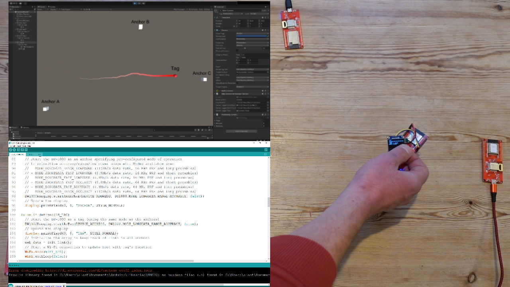

# UWBRTLPS
Ultra Wide Band Real-Time Local Positioning System

Video demonstration: https://youtu.be/-GNkobAxao0

This repository contains the client and server code for a system that can track precise location and movement of objects in realtime, with an accuracy of approximately 10cm.
It is based on the Decawave DW1000 UltraWideband chip incorporated into devices using an ESP32 processor (although will work equally well with an Arduino, Raspberry Pi, or other microprocessor). Each device can be configured as either a static "anchor", or a moveable "tag", and all devices within range measure distance to each other.
By gathering distances to three known anchor points, each tag's location can be determined through a process of trilateration, and these reaults are plotted graphically using a Unity app.

